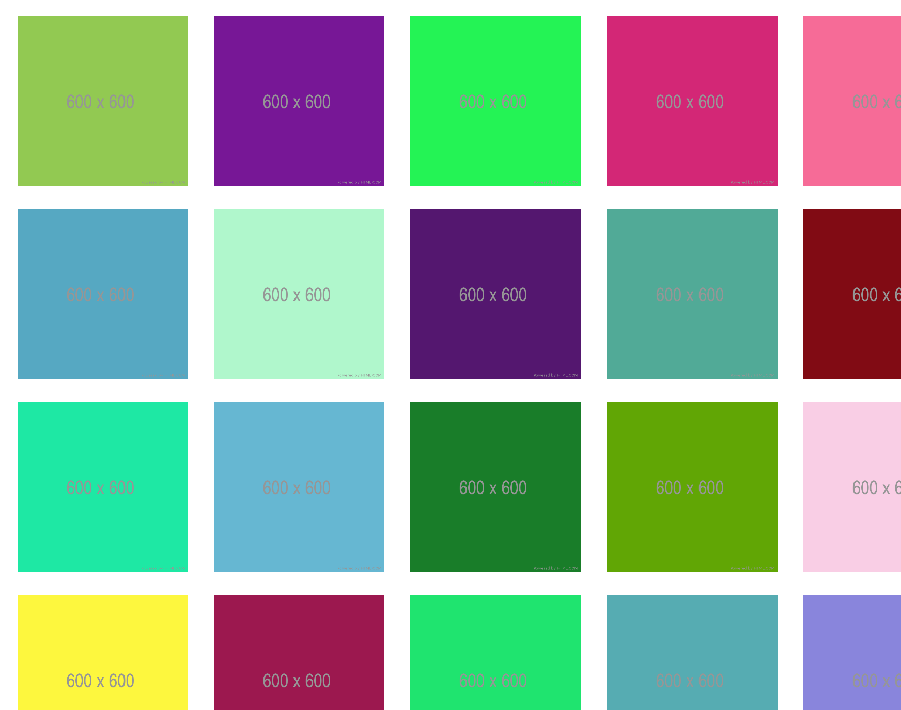

# React App

## 🔹 [Live demo](https://codesandbox.io/s/infinite-scroll-react-3nwl7)

## 📌Instructions

- Please complete the user story below.

- Your code should compile (if necessary) and run in one step. It is ok if there is a build process.

- JavaScript should be used as a platform.

- Use React.js.

- Styles can be added with frameworks, libraries, plain css, preprocessors or postprocessors, be imaginative!

- You must use this placeholder URL for getting the images: <https://jsonplaceholder.typicode.com/photos>

### Nice to have

- The images can’t pop or flicker, they must appear smoothly on the screen.

### User Story

- As a user visits the root URL

- The user can see a grid of images that fill the screen on load

- As the user scrolls the browser, more images are loaded dynamically

- When the user clicks an image, it is removed from the list and disappears

### Acceptance criteria

- The grid should be responsive, showing 2 columns on small devices and more as the device width growths.

## 📌 Getting started

```instruction
- git clone https://github.com/DonatellaC/react-infinite-scroll
- cd react-infinite-scroll
- npm install
- npm start
```

## 📌 Technologies

- HTML
- CSS
- JavaScript
- React
- Axios

## 📌 APIs

- [Photos API](https://jsonplaceholder.typicode.com/photos)


